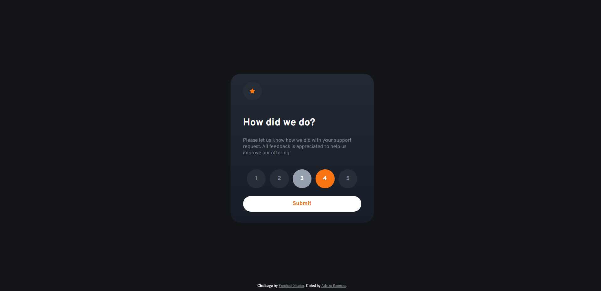

# Frontend Mentor - Interactive rating component solution

This is a solution to the [Interactive rating component challenge on Frontend Mentor](https://www.frontendmentor.io/challenges/interactive-rating-component-koxpeBUmI). Frontend Mentor challenges help you improve your coding skills by building realistic projects.

## Table of contents

- [Overview](#overview)
  - [The challenge](#the-challenge)
  - [Screenshot](#screenshot)
  - [Links](#links)
  - [Built with](#built-with)
  - [Continued development](#continued-development)
  - [Useful resources](#useful-resources)
  - [Author](#author)

## Overview

### The challenge

Users should be able to:

- View the optimal layout for the app depending on their device's screen size
- See hover states for all interactive elements on the page
- Select and submit a number rating
- See the "Thank you" card state after submitting a rating

### Screenshot

### Links

- Solution URL: https://interactive-rating-adrianr1189.pages.dev/
- Frontend Mentor Challenge URL: https://www.frontendmentor.io/challenges/interactive-rating-component-koxpeBUmI

### Built with

- Semantic HTML5 markup
- CSS custom properties
- Flexbox
- Media queries
- Javascript

### Continued development

I have a lot to learn when it comes to Javascript. I'm sure there's a more concise way to code this but I'm glad it works.

### Useful resources

- [DOM Manipulation in JavaScript](https://www.freecodecamp.org/news/dom-manipulation-in-javascript/) - This article helped me understand DOM manipulation.
- [Media Query CSS Tutorial](https://www.freecodecamp.org/news/css-media-queries-breakpoints-media-types-standard-resolutions-and-more/) - This article helped me with media queries.

## Author

- My Github - [Adrian Ramirez](https://github.com/AdrianR1189)
- Frontend Mentor - [@AdrianR1189](https://www.frontendmentor.io/profile/AdrianR1189)
